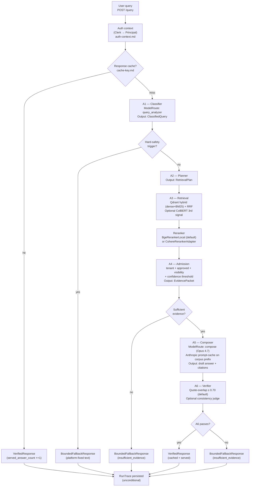
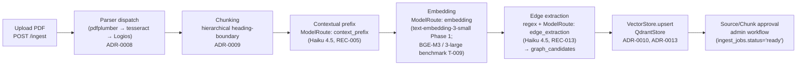

# A1–A6 Pipeline Diagram

Status: Canonical
Date: 2026-05-22

This is the canonical visual reference for the Phase-1 query pipeline. The Mermaid source below renders to a flowchart in any Markdown viewer that supports Mermaid (GitHub, GitLab, mkdocs, Obsidian). SVG export is deferred to the design phase per T-008 (the user-facing UI does not require a polished export until later).

Every stage is normatively defined in the corresponding ADR or contract; this diagram is a cross-reference, not the source of truth.

## Pipeline flowchart

## Stage cross-reference

| Stage | Contract | ADR | Key schema |
|---|---|---|---|
| Auth context | `auth-context.md` | ADR-0003 (multi-tenant), ADR-0016 (RLS) | `principal.schema.json` |
| Response cache | `cache-key.md` | ADR-0005 | (no schema) |
| A1 — Classifier | (in `phase1-implementation-contract.md`) | — | `classified-query.schema.json` |
| Hard-safety triage | `phase1-implementation-contract.md` Appendix A | ADR-0002 | (text fixtures) |
| A2 — Planner | (in `phase1-implementation-contract.md`) | ADR-0007 | `retrieval-plan.schema.json` |
| A3 — Retrieval | `vector-store-interface.md` | ADR-0011, ADR-0013 | `scored-chunk.schema.json`, `chunk.schema.json` |
| Reranker | (in ADR-0012) | ADR-0012 | `scored-chunk.schema.json` |
| A4 — Admission | (in `phase1-implementation-contract.md`) | — | `evidence-packet.schema.json` |
| A5 — Composer | `provider-interface.md` §JSON Mode | ADR-0001 (closed corpus), ADR-0014 (failover) | answer-mode-specific output schemas |
| A6 — Verifier | `quote-overlap-algorithm.md` | ADR-0006 (lineage) | `verified-response.schema.json` |
| RunTrace persistence | `observability.md` | — | `run-trace.schema.json` |

## Ingestion pipeline (separate from query path)

## Notes

- **No draft-answer streaming.** Per decision register row M and `provider-interface.md` §Streaming Boundaries, the token-event variant is absent from the SSE grammar. Progress events flow during pipeline execution; the final `VerifiedResponse` appears all at once after A6 passes.
- **Run trace is unconditional.** Every served request — including hard-safety bypass — mints a `runId` and persists a `RunTrace`. This is the F-18 audit finding's resolution.
- **A4 has no model route.** It is deterministic. ADR-0004 rule 2 codifies this; the diagram reflects it.
- **Failover (ADR-0014) is Phase-2.** The current diagram shows the Phase-1 happy path. When ADR-0014 lands, A5 and A1/A2 stages may have a "→ certified peer" arrow on 5xx/network/latency-breach triggers.
